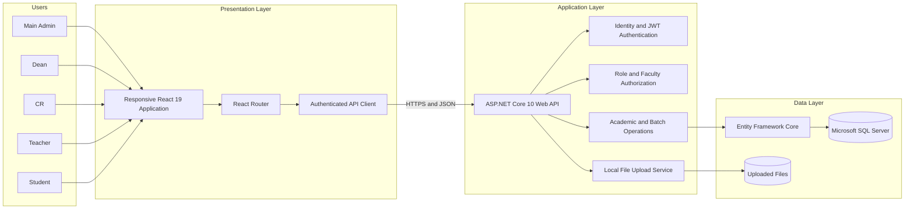
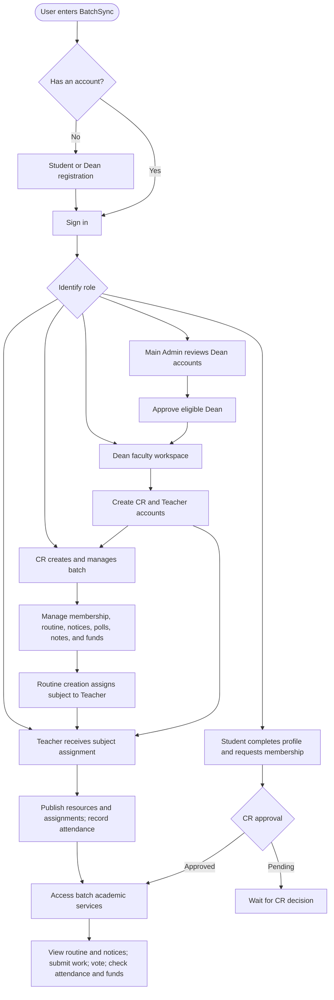
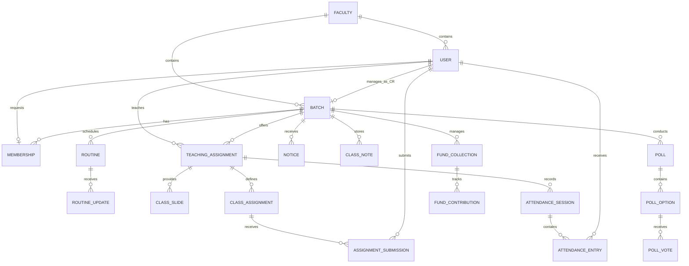

# BatchSync Project Proposal Summary

## 1. Proposed Project Title

**BatchSync — University Academic Coordination & Management System**

## 2. Executive Summary

BatchSync is a centralized role-based university academic coordination and management platform connecting university administration, faculties, departments, batches, teachers, CRs, and students. The system brings routine management, academic communication, attendance, assignments, class resources, student records, polls, and batch funds into one secure platform.

Universities commonly manage these activities through disconnected social media groups, spreadsheets, paper records, and informal messages. This makes information difficult to verify, easy to lose, and slow to update. BatchSync addresses this problem by providing a single role-based source of information for each faculty and batch. It gives authorized users the tools they need while protecting faculty and batch data from unrelated users.

The current project is implemented as a responsive React application connected to an ASP.NET Core Web API and Microsoft SQL Server. Authentication is handled through ASP.NET Core Identity and JSON Web Tokens (JWT). The result is a practical academic coordination platform that improves communication, transparency, record keeping, and day-to-day batch administration.

## 3. Problem Statement

Academic batch activities are often managed through multiple unconnected channels. Routine changes may be posted in chat groups, attendance may be stored in separate spreadsheets, assignments may be distributed through personal messages, and fund records may be maintained manually. This creates several problems:

- Students may miss important routine changes, notices, or deadlines.
- There is no single reliable source for batch information.
- Attendance and assignment records are difficult to review.
- Membership and user responsibilities are not formally controlled.
- Faculty, batch, and student information can become mixed or exposed.
- CRs and teachers spend unnecessary time on repetitive administrative work.
- Manual fund and poll management can reduce transparency.

BatchSync is proposed as a centralized and role-controlled solution to these issues.

## 4. Project Aim

To design and develop a secure, responsive, and centralized university batch coordination system that simplifies academic communication and administration for administrators, deans, CRs, teachers, and students.

## 5. Project Objectives

1. Implement secure registration, login, profile management, and role-based access.
2. Organize users and batches under separate university faculties.
3. Allow the Main Admin to review and approve Dean accounts.
4. Allow approved Deans to create CR and Teacher accounts for their faculty.
5. Allow CRs to manage their batch, students, weekly routine, notices, polls, notes, and funds.
6. Allow Teachers to manage assigned subjects, slides, assignments, submissions, and attendance.
7. Allow Students to request batch membership and access approved batch information.
8. Provide date-specific routine changes without modifying the fixed weekly routine.
9. Maintain searchable and structured academic records in a relational database.
10. Provide a responsive interface suitable for both desktop and mobile devices.

## 6. Target Users and Responsibilities

| User Role | Main Responsibilities |
|---|---|
| Main Admin | Review Dean accounts, approve Deans, and monitor faculty-level setup. |
| Dean | Manage a faculty workspace, create CR and Teacher accounts, view faculty batches, and publish faculty or batch notices. |
| CR | Create and edit a batch, approve students, create routines, assign teachers through routines, record classes, manage notices, notes, polls, and funds. |
| Teacher | View assigned batches and subjects, publish slides and assignments, review submissions, record attendance, and view attendance percentages. |
| Student | Complete a profile, request batch membership, view routines and notices, access notes and slides, submit assignments, view attendance, vote in polls, and check fund status. |

## 7. Core Functional Scope

### User and Access Management

- Student and Dean self-registration
- JWT-based login and authenticated sessions
- Main Admin approval of Dean accounts
- Dean-created CR and Teacher accounts
- Role-based API and interface permissions
- Faculty-based and batch-based data isolation
- Profile completion and profile image upload

### Batch and Academic Coordination

- Batch creation and profile management by the CR
- Student membership requests and CR approval
- Student directory with protected profile details
- Fixed weekly class routine
- Date-specific class time, room, teacher, or cancellation updates
- Automatic Teacher subject assignment when a routine is created
- Daily class completion records and Teacher class totals

### Teaching and Learning

- Teacher subject workspace
- Class slide and resource publishing
- Assignment creation with descriptions, files, and due dates
- Student submission and resubmission
- Teacher access to submitted files and late-status information
- Per-class attendance register
- Subject-wise attendance totals and percentages
- Date-based and course-based class notes

### Communication and Batch Operations

- Faculty-wide and batch-specific notices and reminders
- Time-limited polls with one vote per approved Student
- Controlled poll result visibility
- Batch fund collection creation
- Paid and pending student contribution ledger
- Closing completed fund collections

## 8. Proposed System Architecture

## 9. Main Operational Workflow

## 10. Simplified Data Model

## 11. Technology Stack

| Layer | Technology |
|---|---|
| Frontend | React 19, Vite 7, React Router |
| Backend | C#, ASP.NET Core Web API, .NET 10 |
| Database | Microsoft SQL Server |
| Data Access | Entity Framework Core |
| Authentication | ASP.NET Core Identity and JWT Bearer Tokens |
| File Handling | ASP.NET Core static files and local upload directory |
| API Format | REST-style HTTP endpoints with JSON |
| Development Tools | Node.js, npm, .NET SDK, SQL Server LocalDB or Express |

## 12. Non-Functional Requirements

- **Security:** Password hashing, authenticated API access, JWT validation, and role-based authorization.
- **Privacy:** Faculty and batch boundaries restrict access to academic and student information.
- **Usability:** Responsive navigation and role-specific workspaces reduce unnecessary options.
- **Data integrity:** Relational constraints prevent duplicate memberships, votes, submissions, and attendance entries.
- **Maintainability:** The frontend, API, domain models, and data access are separated into clear application layers.
- **Performance:** Filtered database queries and indexed relationships support common dashboard operations.
- **Reliability:** Date-specific routine updates preserve the original weekly routine and historical records.
- **Scalability:** The API and database structure can be moved to hosted services as usage grows.

## 13. Development Methodology

An iterative development approach is suitable for BatchSync:

1. Analyze university batch workflows and define user roles.
2. Design the database and access-control rules.
3. Implement authentication and faculty/batch setup.
4. Build routine, notice, membership, notes, poll, and fund modules.
5. Add Teacher subject, attendance, resource, and assignment modules.
6. Test permissions, workflows, validation, and responsive layouts.
7. Deploy the frontend, API, database, and durable file storage.
8. Collect user feedback and improve the system in later releases.

## 14. Expected Outcomes and Benefits

- A single reliable source for batch and academic information
- Faster communication of routine changes and official notices
- More transparent attendance, assignment, poll, and fund records
- Reduced manual administrative work for Deans, CRs, and Teachers
- Better access to learning resources and deadlines for Students
- Improved accountability through clear roles and recorded actions
- A structured foundation for wider university digital services

## 15. Current Constraints and Future Scope

The current application is a strong working foundation, but a production deployment should replace local file storage with durable object storage, use a protected production JWT key, enforce production CORS and HTTPS settings, and introduce automated backup and monitoring.

Possible future extensions include:

- Email, SMS, and push notifications
- Administrative reports and downloadable attendance sheets
- Assignment grading and Teacher feedback
- Semester, course, and examination management
- Online payment gateway integration for batch funds
- Calendar synchronization
- Audit logs and advanced analytics
- Cloud deployment and centralized object storage
- Multi-university and multi-campus support

## 16. Conclusion

BatchSync provides a practical solution to fragmented university batch coordination. Its role-based structure reflects real academic responsibilities, while its integrated modules support both academic and administrative work. By combining routine management, communication, teaching resources, assignments, attendance, polls, and funds in one system, BatchSync can improve information accuracy, reduce repetitive work, and create a more transparent experience for every member of a university batch.
